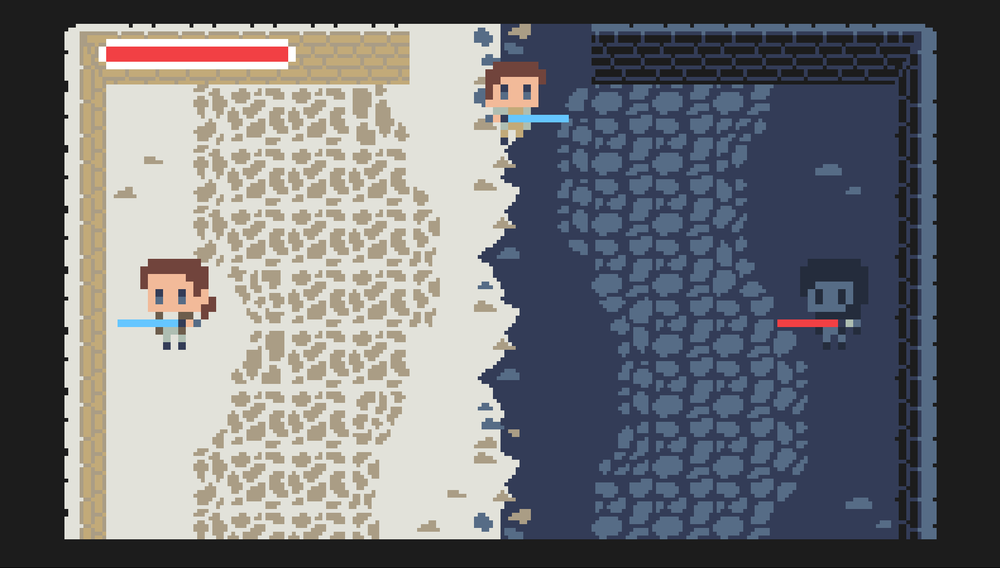

# Astronomical-Wars: The Rise of Duality

  

  
   

  
   

This game was developed for the 2022 edition of the [Global Game Jam](https://globalgamejam.org/2022/games/astonomical-wars-rise-duality-1). 

It was developed during a 48 hour period for the [TIC-80](https://tic80.com/) fantasy console.

**Theme:** Duality

## Concept

A tiny Star Wars inspired beat em up where you must choose the light or the dark path and face your demons!
 
## Controls 🎮

- **Arrows -** Move
- **Z -** Attack/Select
- **Esc -** Menu

## Team 👥

- Bárbara Pinto ([@MadDinosaur](https://github.com/MadDinosaur)) - code
- Cristóvão Sampaio ([@Sakkris](https://github.com/Sakkris)) - art, music
